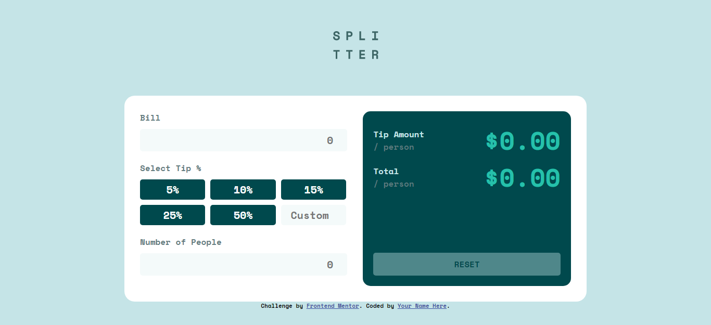
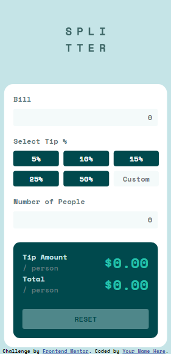

# Frontend Mentor - Tip calculator app solution

This is a solution to the [Tip calculator app challenge on Frontend Mentor](https://www.frontendmentor.io/challenges/tip-calculator-app-ugJNGbJUX). Frontend Mentor challenges help you improve your coding skills by building realistic projects.

## Table of contents

- [Overview](#overview)
  - [The challenge](#the-challenge)
  - [Screenshot](#screenshot)
  - [Links](#links)
- [My process](#my-process)
  - [Built with](#built-with)
  - [What I learned](#what-i-learned)
  - [Continued development](#continued-development)
- [Author](#author)

**Note: Delete this note and update the table of contents based on what sections you keep.**

## Overview
The challenge is Tip calculator app that takes input of bill, number of people and available button of tip or customize input of tip and display the tip and total cost per person, It is responsive across all screen size and also have interactive elements with hover and focus state
### The challenge

Users should be able to:

- View the optimal layout for the app depending on their device's screen size
- See hover states for all interactive elements on the page
- Calculate the correct tip and total cost of the bill per person

### Screenshot





### Links

- Solution URL: [Add solution URL here](https://github.com/TRIPLE-ADE/tip-calculator-app-main)
- Live Site URL: [Add live site URL here](https://triple-ade.github.io/tip-calculator-app-main/)

## My process
- Design the layout
- Responsiveness across different screen sizes 
- Getting HTML element with javascript DOM manipulation
- Created a function that do the calculation by taking three parameter(Tip, Bill, People)
- Add event handlers for click events when the tips button are clicked and keyup for the custom tip input
- display tip and total per person as a text content in another element

### Built with

- Semantic HTML5 markup
- CSS custom properties
- Flexbox
- CSS Grid

**Note: These are just examples. Delete this note and replace the list above with your own choices**

### What I learned

Use this section to recap over some of your major learnings while working through this project. Writing these out and providing code samples of areas you want to highlight is a great way to reinforce your own knowledge.

To see how you can add code snippets, see below:

```html
<h1>Some HTML code I'm proud of</h1>
```
```css
.tip > div{
    gap: 10px; 
    display: grid;
    grid-template-columns: repeat(3,31.5%);
}
.tip input{
    grid-column: 3/4;
}
```
```js
function calculateAmount(billInput, peopleInput, tip) {
    const billTipPercent = billInput * tip/100;
    const totalAmount = billTipPercent + billInput;
    const tipPerPerson = (billTipPercent/peopleInput).toFixed(2);
    const totalPerPerson = (totalAmount/peopleInput).toFixed(2);
    
    //display total and tip amount as textContent 
    total.textContent = `$${totalPerPerson}`;
    tipAmount.textContent = `$${tipPerPerson}`;
}

//selecting all the tip Button
tipBtn.forEach(e => {
    e.addEventListener('click', function () {
        if (people.value && bill.value) {
            let tip = Number(e.textContent.replace("%",''));
            const billInput = parseInt(bill.value);
            const peopleInput = parseInt(people.value);

            //function calculate the amount and display
            calculateAmount(billInput, peopleInput, tip);

            //reset button background color and opacity
            resetBtn.style.backgroundColor = "hsl(172, 67%, 45%)";
            resetBtn.style.opacity = 1;

           
        }else{
            if(bill.value == '' ){
                bill.style.borderColor = 'red';
            }
            else if(people.value == ''){
                people.style.borderColor = 'red' 
            }
            
            //setTimeOut of 2 seconds
            setTimeout(() => {
                people.style.borderColor = 'hsl(172, 67%, 45%)';
                bill.style.borderColor = 'hsl(172, 67%, 45%)';
            }, 2000);
        }
    })
   
})     

//adding event listener to custom tip 
custom.addEventListener('keyup', function (e) {
    if (people.value && bill.value) {
        
        let tip = Number(custom.value);
        const billInput = parseInt(bill.value);
        const peopleInput = parseInt(people.value);

        //function calculate the amount and display
        calculateAmount(billInput, peopleInput, tip);
        resetBtn.style.backgroundColor = "hsl(172, 67%, 45%)";
        resetBtn.style.opacity = 1;
       
    } else{
        if(people.value == ''){
            people.style.borderColor = 'red' 
        } else if(bill.value == '' ){
            bill.style.borderColor = 'red';
        }
        
        setTimeout(() => {
            people.style.borderColor = 'hsl(172, 67%, 45%)';
            bill.style.borderColor = 'hsl(172, 67%, 45%)';
        }, 2000);
    }
   
})
```


### Continued development

Use this section to outline areas that you want to continue focusing on in future projects. These could be concepts you're still not completely comfortable with or techniques you found useful that you want to refine and perfect.
- JavaScript DOM Manipulation
- JavaScript Array, function and Object

## Author

- Website - [Add your name here](https://www.your-site.com)
- Frontend Mentor - [@TRIPLE-ADE](https://www.frontendmentor.io/profile/TRIPLE-ADE)
- Twitter - [@Triple123A](https://www.twitter.com/Triple123A)


